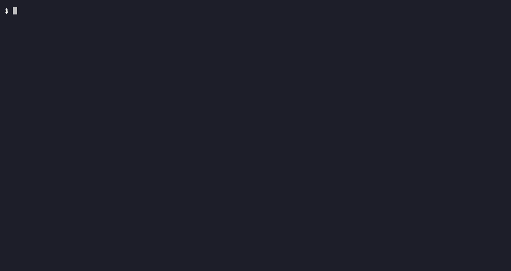

---
hide:
  - navigation
  - toc
---

<div class="tn-hero" markdown>

<h1 class="tn-hero__title">torrnado</h1>

<p class="tn-hero__tagline">
A terminal BitTorrent client with a vim-like TUI.<br>
The engine runs as a daemon, so closing the terminal doesn't stop the download.
</p>

<div class="tn-cta" markdown>
[get started](getting-started/installation.md){ .tn-btn .tn-btn--primary }
[view on github](https://github.com/lestex/torrnado){ .tn-btn .tn-btn--ghost }
</div>

</div>

<div class="tn-terminal">

</div>

<div class="tn-stats">
  <span>macOS</span>
  <span>Linux</span>
  <span>MIT License</span>
  <span>Go 1.25+</span>
  <span><b>v0.5.0</b></span>
</div>

## The idea

The daemon keeps running after the TUI exits. Start a download, close the
terminal, come back tomorrow - it is still going, and the interface
reattaches to it.

That is the one design decision everything else follows from. The TUI and
the CLI are both thin clients that talk to the engine over a local Unix
socket, so neither of them owns the torrents; quitting either one is not
an event the daemon notices.

<p class="tn-label">// features</p>

<div class="tn-features" markdown>

<div class="tn-feature" markdown>
### runs detached
One daemon; the TUI and the CLI attach and detach freely. Quitting a
client is not something the engine notices.
</div>

<div class="tn-feature" markdown>
### survives restarts
The torrent list, paused state, save paths, rate limits and per-file
priorities are written to disk and restored on start.
</div>

<div class="tn-feature" markdown>
### streams while downloading
Press ++v++ on a video and it opens in your player at once, seeking
included - the read position drives which pieces are fetched.
</div>

<div class="tn-feature" markdown>
### three panes, vim keys
A status sidebar, the torrent list and a docked Pieces/Peers/Files pane.
++colon++ opens a command palette; ++h++ lists every key.
</div>

<div class="tn-feature" markdown>
### fully scriptable
Every action is a subcommand, so `torrnado add`, `torrnado list` and
friends work in a shell script or a cron job.
</div>

<div class="tn-feature" markdown>
### waits for your VPN
Optionally holds every transfer until the system's traffic leaves through
a tunnel, and lets them go again when it reconnects.
</div>

</div>

<p class="tn-label">$ install torrnado</p>

<div class="tn-install" markdown>

=== "Install script"

    ```sh
    curl -fsSL https://torrnado.dev/install.sh | sh
    ```

    Picks the archive for your platform, checks it against the release's
    `checksums.txt`, and installs it. [What it
    does](getting-started/installation.md#the-one-liner).

=== "Released binary"

    ```sh
    tar xzf torrnado_0.5.0_linux_amd64.tar.gz
    ./torrnado version
    ```

    Archives for Linux and macOS on both architectures, plus
    `checksums.txt`, are on the [releases
    page](https://github.com/lestex/torrnado/releases).

=== "From source"

    ```sh
    go build -o torrnado ./cmd/torrnado
    ```

    Requires Go 1.25+. `make build` instead stamps the version, commit and
    date in, so `torrnado version` says more than "dev".

=== "Docker"

    ```sh
    docker pull ghcr.io/lestex/torrnado
    docker run --rm ghcr.io/lestex/torrnado version
    ```

    Published per release for amd64 and arm64. For leaving it running on
    a box - see [Docker](server/docker.md).

</div>

<p class="tn-after-install" markdown>
then run `torrnado` to start - [quick start →](getting-started/quick-start.md)
</p>

## Where to go next

<div class="grid cards" markdown>

-   __Start here__

    ---

    Build it, add a torrent, learn six keys.

    [Installation](getting-started/installation.md) ·
    [Quick start](getting-started/quick-start.md)

-   __Drive it__

    ---

    The three panes, the command palette, and every key.

    [The TUI](guide/tui.md) · [Command line](guide/cli.md)

-   __Leave it running__

    ---

    A headless box that downloads things, under systemd or Docker.

    [The daemon](server/daemon.md) · [systemd](server/systemd.md) ·
    [Docker](server/docker.md)

-   __Make it yours__

    ---

    Config, keybinds, nine built-in themes and your own.

    [Configuration](guide/configuration.md) · [Themes](guide/themes.md)

</div>

## What it does not do

No remote control protocol, no web UI, no Windows. The socket is local by
construction and SSH already solves the remote problem properly - see
[non-goals](reference/caveats.md) for the full list and the reasoning.
